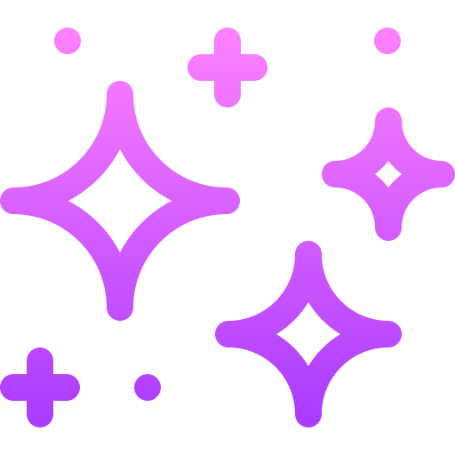

  
  
  
<!-- Portfolio (adicionar link depois)
 
-->

 

<h2 align="center"> About Me</h2>
 

 

Hello there 👋 I'm <b>Aikellanne Almeida</b>, a Computer Science student passionate about technology and software development. 
I enjoy learning new technologies and building projects that turn ideas into practical solutions. 
Currently exploring web development and continuously improving my programming skills.

 
 

<h2 align="center"> Technologies</h2>

  
  
  
  
  
  
  
  
  
  

 

<h2 align="center"> Statistics</h2>

